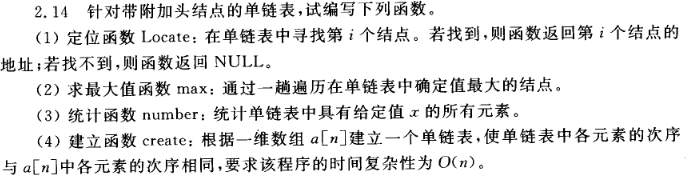
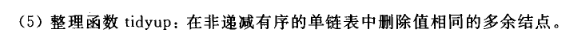
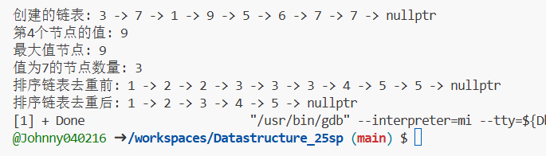

# 单链表操作解答思路
先创建一个单链表节点结构，如下：
```
struct Node {
    int data;
    Node* next;
    
    Node(int value) : data(value), next(nullptr) {}
};
```
## 1. Locate函数
- 从头节点开始遍历链表
- 用计数器记录当前是第几个节点
- 当计数器等于i时返回当前节点
- 如果遍历结束仍未找到，返回NULL
```
// 1. Locate函数：在单链表中查找第i个结点
Node* Locate(Node* head, int i) {
    if (i <= 0) return nullptr;
    
    Node* current = head;
    int count = 1;
    
    while (current && count < i) {
        current = current->next;
        count++;
    }
    return current; 
}
```

## 2. max函数
- 假设头节点存储最大值
- 遍历链表，比较每个节点的值
- 更新最大值节点的指针
- 返回指向最大值节点的指针

```
// 2. max函数：找出单链表中值最大的结点
Node* findMax(Node* head) {
    if (!head) return nullptr;
    
    Node* maxNode = head;
    Node* current = head->next;
    
    while (current) {
        if (current->data > maxNode->data) {
            maxNode = current;
        }
        current = current->next;
    }
    
    return maxNode;
}
```


## 3. number函数
- 初始化计数器为0
- 遍历整个链表
- 每当遇到值为x的节点，计数器加1
- 返回最终计数值

```
// 3. number函数：统计单链表中值为x的元素个数
int countValue(Node* head, int x) {
    int count = 0;
    Node* current = head;
    
    while (current) {
        if (current->data == x) {
            count++;
        }
        current = current->next;
    }
    
    return count;
}
```

## 4. create函数
- 创建头节点存储数组第一个元素
- 依次遍历数组其余元素
- 为每个元素创建新节点并链接到链表尾部
- 时间复杂度为O(n)

```
// 4. create函数：根据数组创建单链表
Node* create(int a[], int n) {
    if (n <= 0) return nullptr;
    
    Node* head = new Node(a[0]);
    Node* tail = head;
    
    for (int i = 1; i < n; i++) {
        tail->next = new Node(a[i]);
        tail = tail->next;
    }
    
    return head; // 时间复杂度O(n)
}
```


## 5. tidyup函数
- 在非递减有序链表中处理
- 使用当前节点与其下一节点比较值
- 若值相同，删除下一节点并调整指针
- 若值不同，移动到下一节点继续比较

```
// 5. tidyup函数：删除非递减有序链表中的重复节点
void tidyup(Node* head) {
    if (!head) return;
    
    Node* current = head;
    
    while (current && current->next) {
        if (current->data == current->next->data) {
            Node* duplicate = current->next;
            current->next = duplicate->next;
            delete duplicate;
        } else {
            current = current->next;
        }
    }
}

```

# 调试代码和运行结果

```
int main() {
    // 测试create函数
    int arr[] = {3, 7, 1, 9, 5, 6, 7, 7};
    Node* list = create(arr, 8);
    std::cout << "创建的链表: ";
    printList(list);
    
    // 测试Locate函数
    int pos = 4;
    Node* found = Locate(list, pos);
    std::cout << "第" << pos << "个节点的值: " << (found ? std::to_string(found->data) : "未找到") << std::endl;
    
    // 测试max函数
    Node* maxNode = findMax(list);
    std::cout << "最大值节点: " << maxNode->data << std::endl;
    
    // 测试number函数
    int target = 7;
    int count = countValue(list, target);
    std::cout << "值为" << target << "的节点数量: " << count << std::endl;
    
    // 创建一个有序链表测试tidyup函数
    int sortedArr[] = {1, 2, 2, 3, 3, 3, 4, 5, 5};
    Node* sortedList = create(sortedArr, 9);
    std::cout << "排序链表去重前: ";
    printList(sortedList);
    
    tidyup(sortedList);
    std::cout << "排序链表去重后: ";
    printList(sortedList);
    
    // 释放内存
    freeList(list);
    freeList(sortedList);
    
    return 0;
}
```
