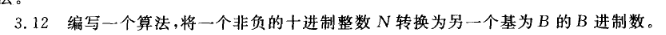
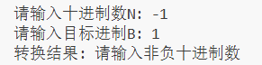

# 十进制转B进制算法

## 原理
将十进制数N转换为B进制的基本算法是：**除以进制取余法**，即重复执行"除以B取余数"，直到商为0，然后逆序输出所有余数。

## 实现过程详解
```
std::string decimalToBase(int N, int B) {
    if (N == 0) return "0";
    if (B < 2 || B > 36) return "无效的进制";
    
    std::stack<char> digits;
    
    while (N > 0) {
        int remainder = N % B;
        char digit;
        
        if (remainder < 10) {
            digit = '0' + remainder;
        } else {
            digit = 'A' + (remainder - 10);
        }
        
        digits.push(digit);
        N /= B;
    }
    
    std::string result = "";
    while (!digits.empty()) {
        result += digits.top();
        digits.pop();
    }
    
    return result;
}

```
1. **特殊情况处理**：

```
    if (N < 0) return "请输入非负十进制数";
    if (B < 2 || B > 36) return "无效的进制";
```
   - 当N为0时，直接返回"0"
   - 当B小于2或大于36时，返回错误信息

2. **转换过程**：
```
    std::stack<char> digits;
    
    while (N > 0) {
        int remainder = N % B;
        char digit;
        
        if (remainder < 10) {
            digit = '0' + remainder;
        } else {
            digit = 'A' + (remainder - 10);
        }
        
        digits.push(digit);
        N /= B;
    }
```
   - 创建一个字符栈`digits`用于存储余数
   - 当N大于0时，执行循环：
     - 计算余数：`remainder = N % B`
     - 将余数转换为字符：
       - 若余数小于10，转换为'0'到'9'
       - 若余数大于等于10，转换为'A'到'Z'
     - 将转换后的字符压入栈中
     - 更新N为N除以B的商：`N /= B`

4. **构建结果**：
```
    std::string result = "";
    while (!digits.empty()) {
        result += digits.top();
        digits.pop();
    }
```
   - 创建空结果字符串
   - 当栈不为空时，循环：
     - 取栈顶元素添加到结果字符串
     - 弹出栈顶元素
   - 返回结果字符串

# 调试代码和运行结果

```
int main() {
    int N, B;
    std::cout << "请输入十进制数N: ";
    std::cin >> N;
    std::cout << "请输入目标进制B: ";
    std::cin >> B;
    std::string result = decimalToBase(N, B);
    std::cout << "转换结果: " << result << std::endl;
    
    return 0;
}
```